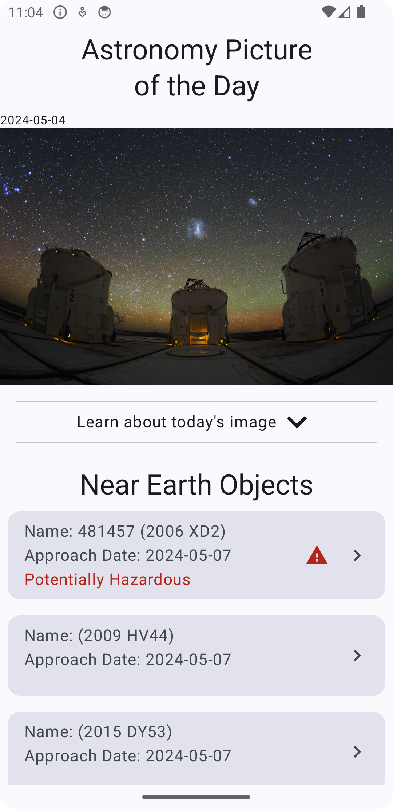
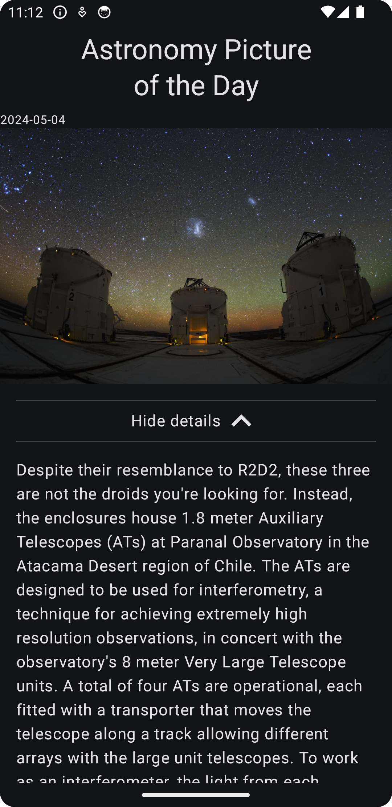
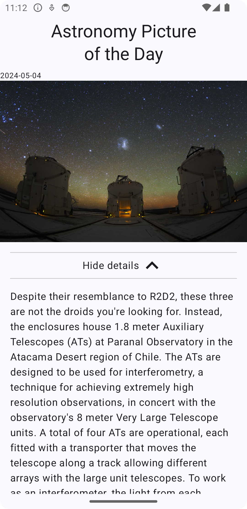
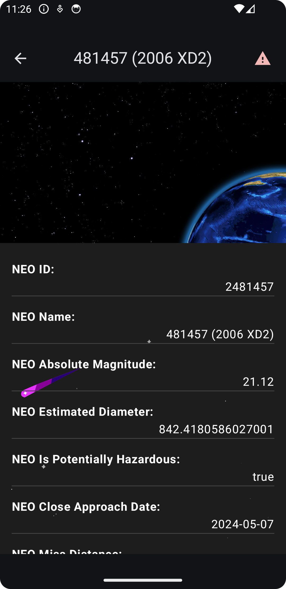
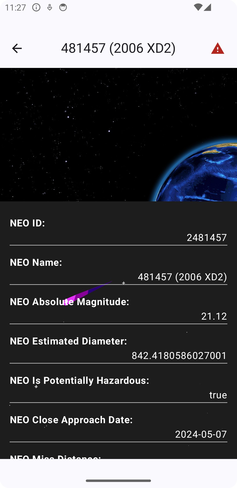
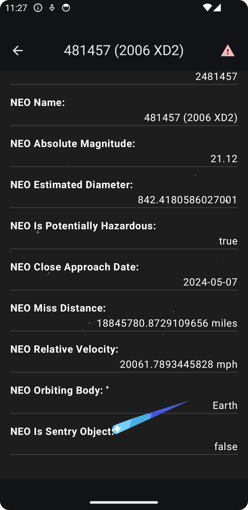
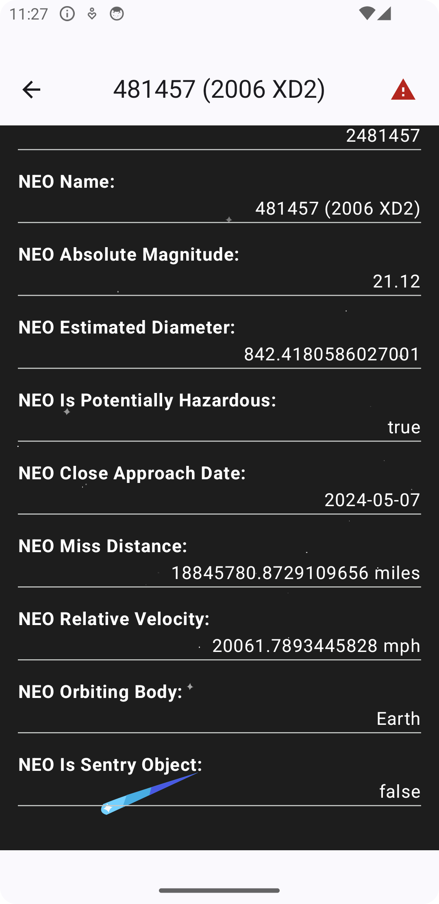
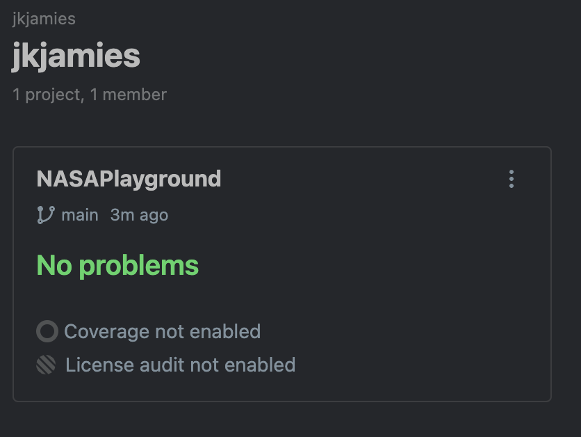
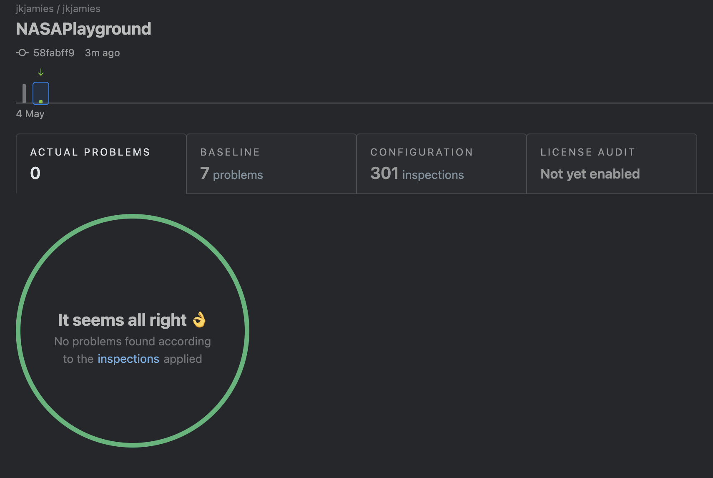

# NASA Playground Android Application

## Design Decisions

There are two separate NASA API services used in this project, the Astronomy Picture of the Day (
APoD) and
the Near Earth Object (NEO) services. The APoD service is used to display the daily image and
information,
while the NEO service is used to display the Near Earth Objects for the current week.

Services were separated to demonstrate the use of multiple services in a single application. Koin
was used
to provide dependency injection for the services and repositories. The repositories were used to
abstract
the data sources from the view models, and the view models were used to abstract the data from the
UI.

Koin context isolation is used to separate the APoD and NEO services, repositories, and view models.
This
allows for the use of a facade pattern to provide a single entry point for the services. This allows
for the use
of Hilt or Dagger (etc) instead of Koin if desired, but Koin was used for this project in the app
module as well.

Packages follow clean architecture principles, with the data, domain, and presentation layers
separated.
Navigation is provided with a type-safe approach using the Jetpack Navigation component. Shared UI
components
were used to show a clean way to provide them as resources across screens.

Services were chosen in a format easy to convert to Kotlin Multiplatform, with the use of Ktor,
Koin, SQLDelight, and more.
The only dependency on android is the context for local database reading in SQLDelight. Easily
solved for with expect/actual
KMP implementations providing the driver for each platform. However due to being an Android project,
KMP structure was
omitted, in favor of a simplistic Android project structure.

## NASA Playground Application

### Running Application

#### Unit Tests:

`./gradlew test`

#### UI Tests:

`./gradlew connectedAndroidTest`

#### Home Screen

| Dark Mode (Default)                                    | Light Mode (Default)                                    |
|--------------------------------------------------------|---------------------------------------------------------|
|           |     |
| Dark Mode (Expanded APoD Details)                      | Light Mode (Expanded APoD Details)                      |
|  |  |

#### NEO Details Screen

| Dark Mode (Default)                                | Light Mode (Default)                                |
|----------------------------------------------------|-----------------------------------------------------|
|           |     |
| Dark Mode (Scrolled)                               | Light Mode (Scrolled)                               |
|  |  |

## Code Quality

### Project Pane

### Project Results

## Improvement Ideas

- Consider combining NASA services - project uses separate modules for demonstration purposes
- Links included in the NeoResponse can be used to get some very interesting information such as
  Orbital Data, etc.
- Save the data as separate NEO so there isn't a need to parse through the saved NEO response in
  cache
- Light mode is dark and text is fixed to white because of the Lottie animation file chosen - this
  could be fixed with multiple assets or a change in tint color, but this was a free resource for
  this demo app
- Add parameters to allow for different dates or date ranges
- Strings resources and localization
- Better failure or offline handling - use error results instead of just null values
- Accessibility improvements
- Passed modifiers to consolidate and reduce code, as well as inheritance of properties
- Kotlin/Wasm to host documentation through GitHub pages via workflow
- Architectural testing using konsist
- Add a work manager to schedule the updates so data is always up to date when user opens the app
- Notifications when the work manager updates the data
- Favorites that persist either outside of the date ranges or just indicators for an exclusive list
- Change from DEMO_KEY to a real key, and abstract and hide it properly - also resource the
  endpoints
- Bottom Navigation Bar for switching between APoD and NEO, as well as Earth and Mars pages
- Expand testing (control objects in ui tests instead of using network), cover more edge cases, and
  add more unit tests
- Dimens for padding values instead of hardcoding values all over
- Automated versioning, release workflow, release notes and tagging
- Qodana automated quick-fixes using `--apply-fixes` or `--cleanup` using `qodana.yaml` in
  project root directory
- Cleaner documentation and readme.md file