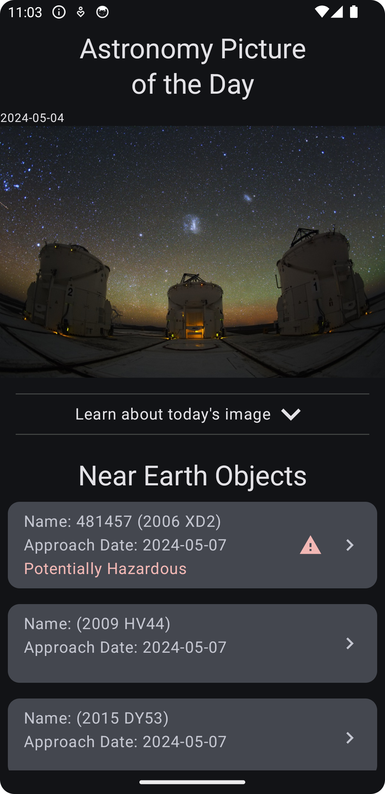

# Improvement Ideas

- Consider combining NASA services - project uses separate modules for demonstration purposes
- Links included in the NeoResponse can be used to get some very interesting information such as
  Orbital Data, etc.
- Save the data as separate NEO so there isn't a need to parse through the saved NEO response in
  cache
- Light mode is dark and text is fixed to white because of the Lottie animation file chosen - this
  could be fixed with multiple assets or a change in tint color, but this was a free resource for
  this demo app
- Add parameters to allow for different dates or date ranges
- Strings resources and localization
- Better failure or offline handling - use error results instead of just null values
- Accessibility improvements
- Passed modifiers to consolidate and reduce code, as well as inheritance of properties
- Kotlin/Wasm to host documentation through GitHub pages via workflow
- Architectural testing using konsist
- Add a work manager to schedule the updates so data is always up to date when user opens the app
- Notifications when the work manager updates the data
- Favorites that persist either outside of the date ranges or just indicators for an exclusive list
- Change from DEMO_KEY to a real key, and abstract and hide it properly - also resource the
  endpoints
- Bottom Navigation Bar for switching between APoD and NEO, as well as Earth and Mars pages
- Expand testing, cover more edge cases, and add more unit tests
- Dimens for padding values instead of hardcoding values all over
- Automated versioning, release workflow, release notes and tagging
- Qodana automated quick-fixes using `--apply-fixes` or `--cleanup` using `qodana.yaml` in
  project root directory

TODO for finishing short project

- Create ui for neo detail screen
- Create shared ui components between apod and neo details
- Add unit tests and ui tests for app

## NASA Playground Application

Home Screen

| Dark Mode (Default)                                    | Light Mode (Default)                                    |
|--------------------------------------------------------|---------------------------------------------------------|
|           |     |
| Dark Mode (Expanded APoD Details)                      | Light Mode (Expanded APoD Details)                      |
|  |  |

NEO Details Screen

| Dark Mode (Default)                                | Light Mode (Default)                                |
|----------------------------------------------------|-----------------------------------------------------|
|           |     |
| Dark Mode (Scrolled)                               | Light Mode (Scrolled)                               |
|  |  |

## Code Quality

Project Pane

Project Results

